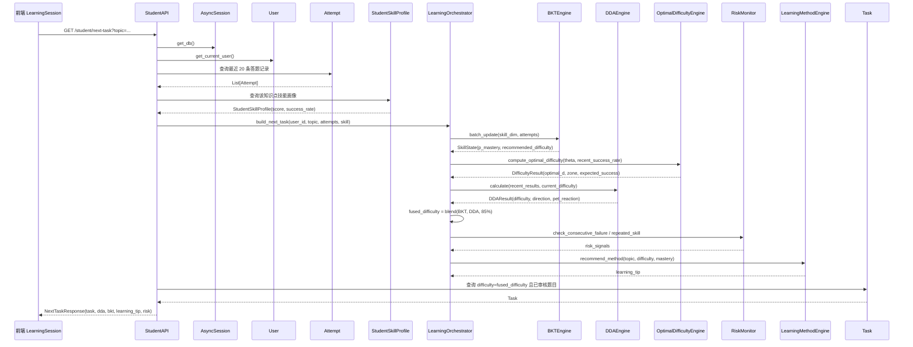
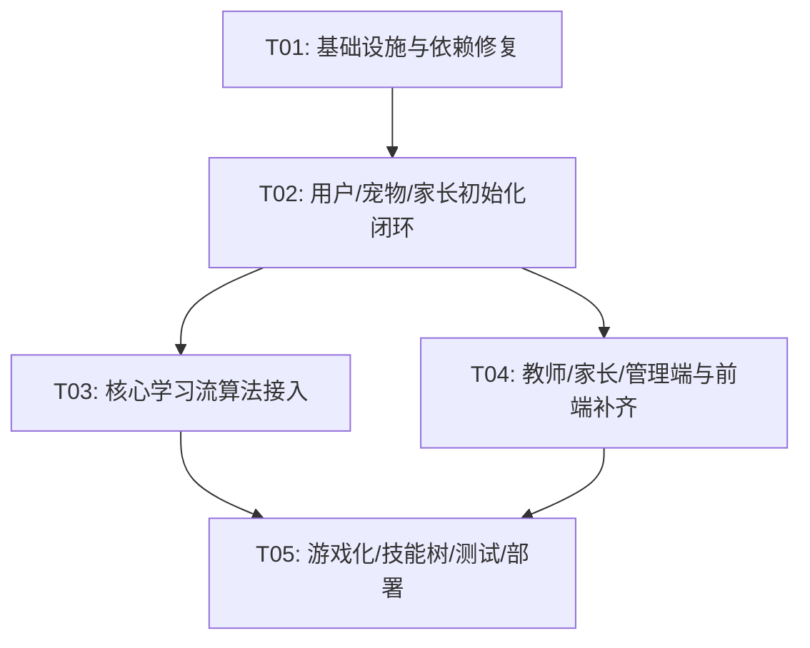

# LearnFlow 增量架构设计（v1.0.0）

> **目标**：基于现有 FastAPI + React 代码库，补齐 P0 阻塞与关键 P1 功能，使 LearnFlow 从“接口/引擎就绪”升级为“端到端可用”。
>
> **范围**：后端 `H:\learnflow-backend` + 前端 `H:\learnflow-frontend`。
> **日期**：2026-06-20

---

## 1. 增量实现方案与框架选型

### 1.1 核心挑战

| 难点 | 现有问题 | 解决思路 |
|------|----------|----------|
| 数据闭环缺口 | 新注册用户/演示账号无宠物、无技能画像、无默认家长绑定 | 统一 `OnboardingService` 在注册与种子化时自动创建 |
| 算法与业务流脱节 | BKT / 85% / 间隔重复 / 风险监控 未接入 `next-task` / `submit-answer` | 新增 `LearningOrchestrator` 串联所有引擎 |
| 运行时缺陷 | `seed.py` 导入 `AsyncSessionLocal` 失败；教师 AI 端点 `cls._count_consecutive_fails` 报错 | 修复 `database.py` 导出；教师 AI 端点改为顶层函数调用 |
| 前后端脱节 | 连胜、排行榜、战队、技能树、宝箱等后端能力未暴露 | 新增 `/student/gamification/*` 端点与对应前端页面 |
| 依赖冲突 | `pydantic-settings==2.4.0` 与当前 `pydantic` 不兼容导致测试收集失败 | 锁定兼容版本并升级测试依赖 |

### 1.2 框架选型（沿用）

| 层级 | 技术 | 版本/说明 |
|------|------|-----------|
| 前端 | React 18 + TypeScript + Vite 5 + Tailwind CSS | 已存在，增量补页面 |
| 后端 | FastAPI 0.115.0 + SQLAlchemy 2.0 async + Pydantic v2 | 已存在 |
| 数据库 | SQLite（默认/CloudBase 降级）/ aiomysql | 已存在 |
| 缓存 | 可选 Redis | 本次不新增依赖 |
| 部署 | 腾讯云 CloudBase（后端容器 + 前端静态托管） | 沿用 |

### 1.3 架构模式

- **后端**：Router-Service-Model 三层结构。API 层（`app/api/*`）负责 HTTP/校验/依赖注入；服务层（`app/services/*`）负责算法/业务规则；模型层（`app/models/*`）负责数据持久化。
- **前端**：函数组件 + Hooks + React Router + `api.ts` 集中封装。
- **新增核心**：`LearningOrchestrator` 作为“学习流指挥官”，将原本孤立的 BKT、DDA、85% 规则、间隔重复、风险监控、宠物成长、学习方法推荐串联到同一事务中。

---

## 2. 新增/修改文件列表

### 2.1 后端（`H:\learnflow-backend`）

```
requirements.txt                       # 修改：锁定 pydantic-settings 兼容版本
pyproject.toml                         # 新增/修改：pytest 配置、工具链
pytest.ini                             # 新增：测试路径与 asyncio 模式

app/main.py                            # 修改：启动顺序、演示账号种子化、路由注册
app/core/database.py                   # 修改：导出 AsyncSessionLocal，供 seed.py 使用
app/core/config.py                     # 修改（可选）：增加 DDA/BKT 学习参数

app/models/user.py                     # 修改：default consents，家长关系辅助方法
app/models/pet.py                      # 修改：确保默认四维 50
app/services/onboarding_service.py     # 新增：统一注册/初始化服务
app/api/auth.py                        # 修改：注册/OAuth 后调用 onboarding

app/services/learning_orchestrator.py  # 新增：核心学习流编排器
app/api/student.py                     # 修改：next-task / submit-answer / health-check 接入算法
app/services/feedback_service.py       # 修改：返回学习方法提示
app/services/teacher_ai_assistant.py   # 修改：修复 _count_consecutive_fails 调用
app/api/teacher.py                     # 修改：修复 AI 端点、新增学生详情/难度调整/创建题目

app/api/parent.py                      # 修改：确保演示家长关系可访问
app/api/admin.py                       # 修改（可选）：审核/文案创建完善
app/api/gamification.py                # 新增：连胜/排行榜/战队/技能树/宝箱/错题复习 端点
app/services/gamification_service.py   # 修改/新增：封装游戏化引擎为 API 可用方法

Dockerfile                             # 修改：统一生产镜像，移除调试 Dockerfile
cloudbaserc.json                       # 修改（可选）：CloudBase 部署配置
tests/test_student_flow.py             # 新增：核心学习流端到端测试
tests/test_onboarding.py               # 新增：用户初始化与宠物/家长绑定测试
tests/test_teacher_ai.py               # 修改：补齐教师 AI 端点测试
```

### 2.2 前端（`H:\learnflow-frontend`）

```
src/services/api.ts                    # 修改：新增所有端点封装
src/App.tsx                            # 修改：新增路由
src/pages/StudentDashboard.tsx         # 修改：增加连胜/Xp/技能树/战队入口
src/pages/LearningSession.tsx          # 修改：接入学习方法提示、结束总结、错题入口
src/pages/TeacherDashboard.tsx         # 修改：学生详情、题目创建、告警处理、AI 分析
src/pages/ParentSummary.tsx            # 修改：使用真实 parentApi.childSummary
src/pages/AdminPanel.tsx               # 修改：待审核题目列表、审核按钮、文案创建
src/pages/SkillTreePage.tsx            # 新增：学习技能树可视化
src/pages/StreakPage.tsx               # 新增：连胜与 League
src/pages/LeaderboardPage.tsx          # 新增：排行榜
src/pages/TeamPage.tsx                 # 新增：战队
src/pages/PetCustomizePage.tsx         # 新增：宠物详情/装扮
src/components/pet/PetCard.tsx        # 修改：展示宠物心情与等级进度
src/components/common/Layout.tsx       # 修改（可选）：导航入口
```

---

## 3. 数据结构与接口变更

### 3.1 新增 Pydantic Schema（后端）

```python
# app/api/student.py 新增/扩展
class TaskSubmitRequest(BaseModel):
    task_id: str
    answer: str
    time_spent: int | None = None
    hints_used: int = 0
    is_retry: bool = False
    is_creative: bool = False

class NextTaskResponse(BaseModel):
    task: TaskOut
    dda: DDAResponse
    bkt: BKTResponse        # 新增：知识点掌握度、推荐难度
    learning_tip: dict      # 新增：学习方法提示
    risk: dict              # 新增：风险预警（如需要）

class SubmitAnswerResponse(BaseModel):
    is_correct: bool
    correct_answer: str | None
    explanation: str | None
    feedback: FeedbackResponse
    pet_update: dict
    spaced_review: dict     # 新增：下次复习计划
    xp_update: dict         # 新增：XP 奖励
    risk_alert: dict | None # 新增：触发的风险告警
    method_xp: dict         # 新增：学习方法技能 XP

class HealthCheckResponse(BaseModel):
    should_rest: bool
    risk_level: str
    message: str
    consecutive_minutes: int
```

### 3.2 新增 API 端点

| 模块 | 方法 | 端点 | 说明 |
|------|------|------|------|
| 学生 | GET | `/student/due-reviews` | 到期复习列表 |
| 学生 | GET | `/student/health-check` | 真实风险检查（基于 RiskMonitor） |
| 学生 | GET | `/student/gamification/streak` | 连胜状态 |
| 学生 | GET | `/student/gamification/xp` | XP 与 League |
| 学生 | GET | `/student/gamification/leaderboard` | 排行榜 |
| 学生 | GET | `/student/gamification/team` | 战队信息 |
| 学生 | GET | `/student/gamification/skill-tree` | 学习技能树 |
| 学生 | POST | `/student/gamification/open-box` | 开宝箱 |
| 学生 | GET | `/student/gamification/memory-palace` | 记忆宫殿提示 |
| 教师 | POST | `/teacher/ai/adjust-difficulty` | 调整学生难度（已存在，需前端接入） |
| 教师 | POST | `/teacher/tasks` | 创建题目（已存在，需前端接入） |
| 家长 | GET | `/parent/child/{id}/summary` | 已存在，需演示家长绑定后可用 |
| 管理 | GET | `/admin/pending-tasks` | 已存在，需前端接入真实列表 |
| 管理 | POST | `/admin/review-task` | 已存在，需前端接入审核按钮 |
| 管理 | POST | `/admin/feedback-scripts` | 已存在，需前端接入创建表单 |

### 3.3 类图（Mermaid）

```mermaid
classDiagram
    class User {
        +str id
        +str email
        +str hashed_password
        +str name
        +UserRole role
        +str grade
        +str parent_id
        +bool is_active
        +dict consents
        +relationship pet
        +relationship skill_profile
    }
    class PetProfile {
        +str id
        +str user_id
        +str name = "小豆"
        +PetBreed breed = CAT
        +int level = 1
        +PetMood mood = HAPPY
        +float understanding = 50.0
        +float persistence = 50.0
        +float creativity = 50.0
        +float collaboration = 50.0
        +dict visuals_state
        +total_score() float
        +dominant_trait() str
        +get_level_progress() float
    }
    class Task {
        +str id
        +str title
        +str content
        +str topic
        +int difficulty
        +str correct_answer
        +str explanation
        +bool is_approved
        +str source
        +str created_by
    }
    class Attempt {
        +str id
        +str user_id
        +str task_id
        +str answer
        +bool is_correct
        +int time_spent
        +int hints_used
        +int difficulty_at_time
    }
    class SpacedReview {
        +str id
        +str user_id
        +str task_id
        +int review_number
        +datetime scheduled_date
        +datetime completed_date
        +bool result
        +float next_interval_days
    }
    class StudentSkillProfile {
        +str id
        +str user_id
        +str skill_dim
        +float score = 50.0
        +float confidence = 0.5
        +int total_attempts
        +int correct_attempts
        +float mastery
        +success_rate() float
    }
    class Alert {
        +str id
        +str user_id
        +AlertType alert_type
        +AlertSeverity severity
        +str title
        +str description
        +bool is_resolved
        +str resolved_by
    }
    class OnboardingService {
        +ensure_default_pet(user, db) PetProfile
        +ensure_default_skill_profile(user, db) StudentSkillProfile
        +ensure_default_consents(user, db) None
        +bind_demo_parent(user, db) User
        +onboard(user, db) dict
    }
    class LearningOrchestrator {
        +build_next_task(user, topic, db) NextTaskResponse
        +process_submission(user, task, req, db) SubmitAnswerResponse
        +_compute_fused_difficulty(bkt, dda, optimal) int
        +_build_risk_snapshot(user, db) UsageSnapshot
    }
    class BKTEngine {
        +update(state, skill_dim, is_correct) SkillState
        +recommend_difficulty(skill) int
        +get_skill_report(state) dict
    }
    class DDAEngine {
        +calculate(recent_results, current_difficulty) DDAResult
    }
    class OptimalDifficultyEngine {
        +compute_optimal_difficulty(theta, sigma, recent_rate, n) DifficultyResult
    }
    class RiskMonitor {
        +assess(snapshots) RiskAssessment
        +check_consecutive_failure(count) dict
        +check_repeated_skill(skills) dict
    }
    class SpacedRepetitionService {
        +calculate_next_review(review_number, was_correct, interval) dict
        +get_due_reviews(reviews, now) list
    }
    class PetService {
        +calculate_correct_answer(difficulty, hints, is_retry, is_creative) PetUpdateEvent
        +calculate_wrong_answer(difficulty, chosen_recovery) PetUpdateEvent
        +apply_update(pet, event) PetProfile
    }
    class GamificationService {
        +get_streak(user_id) dict
        +get_xp(user_id) dict
        +get_leaderboard() list
        +get_skill_tree(user_id) dict
        +open_box(user_id) dict
    }

    User "1" -- "1" PetProfile : has
    User "1" -- "*" StudentSkillProfile : has
    User "1" -- "*" Attempt : makes
    Task "1" -- "*" Attempt : attempted
    User "1" -- "*" SpacedReview : has
    User "1" -- "*" Alert : has
    OnboardingService ..> User : creates/updates
    OnboardingService ..> PetProfile : creates
    OnboardingService ..> StudentSkillProfile : creates
    LearningOrchestrator ..> BKTEngine : uses
    LearningOrchestrator ..> DDAEngine : uses
    LearningOrchestrator ..> OptimalDifficultyEngine : uses
    LearningOrchestrator ..> RiskMonitor : uses
    LearningOrchestrator ..> SpacedRepetitionService : uses
    LearningOrchestrator ..> PetService : uses
    LearningOrchestrator ..> GamificationService : uses
    StudentAPI ..> LearningOrchestrator : depends
    StudentAPI ..> OnboardingService : depends
    AuthAPI ..> OnboardingService : depends
```



### 3.4 关键响应字段增强

- `next-task` 返回 `bkt.mastery`、`bkt.recommended_difficulty`、`learning_tip`。
- `submit-answer` 返回 `spaced_review.scheduled_date`、`xp_update`。
- `dashboard` 返回 `has_pet: True`（所有用户默认有宠物）。
- `health-check` 基于 `RiskMonitor` 返回真实 `risk_level`。

---

## 4. 程序调用流程（时序图）

### 4.1 获取下一题 `GET /student/next-task`



### 4.2 提交答案 `POST /student/submit-answer`

```mermaid
sequenceDiagram
    participant C as 前端 LearningSession
    participant S as StudentAPI
    participant DB as AsyncSession
    participant T as Task
    participant A as Attempt
    participant SP as StudentSkillProfile
    participant BKT as BKTEngine
    participant SR as SpacedRepetitionService
    participant PS as PetService
    participant FS as FeedbackService
    participant RM as RiskMonitor
    participant XP as XPEngine
    participant LM as MetaLearningSkillTree
    participant Al as Alert

    C->>S: POST /student/submit-answer
    S->>DB: get_db()
    S->>T: 查询题目

    S->>S: normalize_answer()
    S->>S: is_correct = compare

    S->>A: 创建 Attempt(user_id, task_id, answer, is_correct, time_spent, ...)
    DB->>A: INSERT

    S->>SP: 查询/创建 StudentSkillProfile(skill_dim)
    SP->>SP: total_attempts += 1; correct_attempts += 1 if is_correct
    SP->>SP: score = success_rate * 100

    S->>BKT: update(state, skill_dim, is_correct)
    BKT-->>S: p_mastery
    SP->>SP: mastery = p_mastery

    S->>SR: calculate_next_review(review_number, is_correct, current_interval)
    SR-->>S: {next_review_date, next_interval_days}
    S->>SR: 创建 SpacedReview(user_id, task_id, scheduled_date, next_interval_days)
    DB->>SR: INSERT

    S->>PS: calculate_correct_answer / calculate_wrong_answer
    PS->>PS: apply_update(pet)
    DB->>PS: UPDATE pet_profiles

    S->>FS: generate_task_feedback(context)
    FS-->>S: feedback + recovery_options + learning_method_tip

    S->>RM: assess(snapshots) / check_consecutive_failure
    RM-->>S: RiskAssessment
    alt risk_level >= WARNING
        S->>Al: 创建 Alert(user_id, alert_type, severity, title)
        DB->>Al: INSERT
    end

    S->>XP: award_xp(state, event_type, streak)
    XP-->>S: xp_earned, leveled_up

    S->>LM: add_skill_xp(method_id, xp)
    LM-->>S: skill_update

    S->>DB: commit
    S-->>C: SubmitAnswerResponse(...)
```

---

## 5. 待明确事项（基于团队决策已消除）

本次增量设计基于团队决策进行，以下问题已明确：

1. **家长绑定策略**：新注册学生不强制绑定家长；演示账号种子化时统一生成 4 个默认家长并绑定到对应学生/教师/管理员账号。
2. **宠物默认值**：所有新用户注册或演示账号初始化时自动创建名为“小豆”的默认宠物，四维默认 50，物种 `cat`。
3. **OAuth 范围**：继续模拟 QQ/微信 OAuth（前端生成 UID），不接入真实第三方回调。
4. **BKT 持久化**：不新增表，BKT 状态基于答题历史在线计算，通过 `StudentSkillProfile` 的 `mastery` 字段近似。
5. **测试目标**：修复 `pydantic_settings` 版本冲突，补齐测试到 420 个并全部通过。
6. **部署目标**：包含重新部署 CloudBase（后端 + 前端静态托管）。
7. **移动端优先级**：保持 P2，不阻塞本次核心交付。

**无额外待明确事项。**

---

## 6. 依赖包列表

### 6.1 后端 Python 依赖（变更）

```text
# 修复版本冲突
pydantic==2.8.0
pydantic-settings>=2.3.0,<2.8.0

# 已有核心依赖（无需变更）
fastapi==0.115.0
uvicorn[standard]==0.30.0
sqlalchemy==2.0.35
aiomysql==0.2.0
aiosqlite==0.20.0
alembic==1.13.0
pydantic[email]==2.8.0
python-jose[cryptography]==3.3.0
bcrypt>=4.0.0,<5.0.0
python-multipart==0.0.9
redis==5.0.0
httpx==0.27.0
celery==5.4.0
tenacity==8.5.0
loguru==0.7.2

# 测试依赖
pytest>=8.0.0
pytest-asyncio>=0.23.0
pytest-cov>=5.0.0
```

### 6.2 前端依赖（无需新增）

```text
react ^18.3.1
react-dom ^18.3.1
react-router-dom ^6.26.0
axios ^1.7.0
recharts ^2.12.0
framer-motion ^11.0.0
lucide-react ^0.400.0
clsx ^2.1.0
vite ^5.4.0
tailwindcss ^3.4.0
```

---

## 7. 有序任务列表（依赖关系）

### 任务总览

| 任务 ID | 任务名称 | 优先级 | 依赖 |
|---------|----------|--------|------|
| T01 | 基础设施与依赖修复 | P0 | — |
| T02 | 用户、宠物、家长关系初始化闭环 | P0 | T01 |
| T03 | 核心学习流算法接入 | P0 | T02 |
| T04 | 教师/家长/管理端 API 与前端补齐 | P0/P1 | T02 |
| T05 | 游戏化/技能树/测试覆盖/部署 | P1/P0 | T03, T04 |

### T01：基础设施与依赖修复

**Source Files**：
- `requirements.txt` — 锁定 `pydantic-settings` 到兼容版本，补充测试依赖。
- `pyproject.toml` / `pytest.ini` — 配置 pytest asyncio 模式、测试路径、覆盖率。
- `app/core/database.py` — 导出 `AsyncSessionLocal`，修复 `seed.py` 导入失败。
- `app/main.py` — 整理启动事件，确保路由只注册一次，演示账号种子化使用统一入口。
- `seed.py` — 改为使用 `app.core.database.AsyncSessionLocal` 或 `_get_sessionmaker()`。

**Dependencies**：无
**Priority**：P0

**Acceptance Criteria**：
- `pytest --collect-only` 不再因 `pydantic_settings` 报错。
- `python seed.py` 可成功运行并初始化数据库。
- `python -m pytest tests/` 能收集到全部测试用例。

---

### T02：用户、宠物、家长关系初始化闭环

**Source Files**：
- `app/models/user.py` — 确保 `consents` 默认值、家长关系。
- `app/models/pet.py` — 确认默认四维 50、名称“小豆”、物种 `cat`。
- `app/services/onboarding_service.py` — **新增**：统一处理用户注册后的默认宠物、默认技能画像、默认同意设置、演示家长绑定。
- `app/api/auth.py` — 在 `register` 与 `login_oauth` 后调用 `OnboardingService`。
- `app/main.py` — `_ensure_demo_users()` 改为创建 4 个默认家长并绑定到学生/教师/管理员账号。
- `seed.py` — 使用 `OnboardingService` 创建演示数据，避免重复逻辑。

**Dependencies**：T01
**Priority**：P0

**Acceptance Criteria**：
- 新注册学生调用 `/student/pet` 返回 `has_pet: True`。
- 演示家长 `parent@learnflow.com` 可查看学生 `student@learnflow.com` 的摘要。
- 教师/管理员演示账号也拥有默认宠物与家长关系。

---

### T03：核心学习流算法接入

**Source Files**：
- `app/services/learning_orchestrator.py` — **新增**：
  - `build_next_task(user, topic)`：整合 BKT、DDA、85% 规则、风险监控、学习方法推荐。
  - `process_submission(user, task, request)`：处理答案、更新 BKT、创建 SpacedReview、更新宠物、风险告警、XP、学习方法 XP。
- `app/api/student.py` — `next-task` 与 `submit-answer` 改用 `LearningOrchestrator`；`health-check` 接入 `RiskMonitor`。
- `app/services/teacher_ai_assistant.py` — 修复 `cls._count_consecutive_fails` 为调用顶层 `_count_consecutive_fails`。
- `app/api/teacher.py` — 修复 `/teacher/ai/student-analysis/{id}` 运行时错误；完善学生详情与难度调整。
- `app/services/feedback_service.py` — 在反馈文案中加入 `learning_method_tip`。

**Dependencies**：T02
**Priority**：P0

**Acceptance Criteria**：
- `next-task` 返回包含 `bkt` 与 `learning_tip` 字段。
- 答对后数据库出现 `SpacedReview` 记录；答错后给出恢复选项并创建错题复习计划。
- `/teacher/ai/student-analysis/{id}` 不再 500。
- `/student/health-check` 返回真实 `risk_level`（基于连续答题/夜间/失败）。

---

### T04：教师/家长/管理端 API 与前端补齐

**Source Files**：
- `app/api/teacher.py` — 题目创建、学生详情、AI 分析、告警处理、难度调整。
- `app/api/parent.py` — 家长关系校验兼容演示账号绑定。
- `app/api/admin.py` — 待审核题目、审核、文案创建（已存在，按需微调）。
- `frontend/src/services/api.ts` — 增加学生详情、题目创建、审核、家长摘要等接口。
- `frontend/src/pages/TeacherDashboard.tsx` — 增加学生行点击详情、题目创建按钮、告警处理、AI 建议展示。
- `frontend/src/pages/ParentSummary.tsx` — 改为调用 `parentApi.childSummary(childId)` 展示真实数据。
- `frontend/src/pages/AdminPanel.tsx` — 接入 `/admin/pending-tasks`、审核按钮、文案创建表单。

**Dependencies**：T02（T03 完成后可验证端到端，但 T04 后端接口不硬依赖 T03）
**Priority**：P0/P1

**Acceptance Criteria**：
- 教师可创建题目并进入管理员审核队列。
- 管理员可在 `content` Tab 看到真实待审核题目并通过/拒绝。
- 家长登录后能看到真实孩子数据，不再使用硬编码演示数据。

---

### T05：游戏化/技能树/测试覆盖/部署

**Source Files**：
- `app/api/gamification.py` — **新增**：连胜、XP/League、排行榜、战队、技能树、开宝箱、记忆宫殿、到期复习。
- `app/services/gamification_service.py` — 封装 `DuolingoStreakEngine`、`XPEngine`、`LeagueEngine`、`TeamManagementEngine`、`SkillTreeEngine` 等。
- `frontend/src/services/api.ts` — 增加游戏化端点封装。
- `frontend/src/App.tsx` — 新增 `/student/skill-tree`、`/student/streak`、`/student/leaderboard`、`/student/team`、`/student/pet` 路由。
- `frontend/src/pages/SkillTreePage.tsx`、`StreakPage.tsx`、`LeaderboardPage.tsx`、`TeamPage.tsx`、`PetCustomizePage.tsx` — **新增**。
- `frontend/src/pages/StudentDashboard.tsx` — 增加游戏化入口卡片。
- `tests/test_student_flow.py`、`tests/test_onboarding.py` — **新增**；修复已有测试文件以消除收集错误。
- `Dockerfile` — 统一生产镜像，删除 `Dockerfile.hello`/`Dockerfile.minimal` 等调试文件。
- `cloudbaserc.json` / 部署脚本 — 更新 CloudBase 部署配置。

**Dependencies**：T03, T04
**Priority**：P1/P0（测试为 P0，移动端为 P2）

**Acceptance Criteria**：
- 测试总数达到 420 个，全部通过。
- 前端可通过新页面查看连胜、排行榜、技能树。
- 后端可成功部署到 CloudBase 并运行。

---

## 8. 共享知识与跨文件约定

### 8.1 后端约定

1. **所有 API 响应**：统一使用 `dict` 或 Pydantic 模型；成功时返回 200，业务错误用 `HTTPException`。
2. **数据库会话**：通过 `Depends(get_db)` 注入；服务层不直接管理事务，异常由 `get_db` 自动回滚。
3. **用户角色**：`UserRole` 枚举（student/teacher/parent/admin），注册后不可修改。
4. **BKT 状态**：不持久化到独立表；基于 `StudentSkillProfile` 的 `mastery` 字段近似，每次 `next-task` 时在线计算。
5. **宠物四维**：`understanding`（理解力）、`persistence`（坚持力）、`creativity`（创造力）、`collaboration`（协作力），默认 50，范围 0-100。
6. **难度等级**：1-10 整数；`next-task` 最终难度由 `LearningOrchestrator` 融合 BKT、DDA、85% 规则后输出。
7. **时间存储**：所有 `datetime` 使用 `datetime.now(UTC)`，前端展示时自行转换。
8. **演示账号**：
   - `student@learnflow.com` ↔ `parent_student@learnflow.com`
   - `teacher@learnflow.com` ↔ `parent_teacher@learnflow.com`
   - `parent@learnflow.com` ↔ `parent_parent@learnflow.com`（可选，或直接使用原 parent）
   - `admin@learnflow.com` ↔ `parent_admin@learnflow.com`

### 8.2 前端约定

1. **API 基础路径**：`import.meta.env.VITE_API_BASE || '/api/v1'`。
2. **Token 存储**：`localStorage` 中 `access_token` / `refresh_token`；`api.ts` 自动注入与刷新。
3. **路由结构**：
   - `/student` 仪表盘
   - `/student/learn` 学习会话
   - `/student/streak` 连胜
   - `/student/leaderboard` 排行榜
   - `/student/team` 战队
   - `/student/skill-tree` 技能树
   - `/student/pet` 宠物装扮
   - `/teacher` 教师面板
   - `/parent` 家长摘要
   - `/admin` 管理控制台
4. **组件样式**：优先使用 Tailwind CSS 类；保留现有 `card`/`btn` 类名；内联样式仅用于动态值。
5. **错误处理**：API 调用失败时统一 `console.error` 或跳转 `/login`（401 时）。

### 8.3 测试约定

1. **测试框架**：`pytest` + `pytest-asyncio`；异步测试使用 `async def` + `@pytest.mark.asyncio`。
2. **测试数据库**：使用 `aiosqlite` 内存数据库或临时 SQLite 文件，避免污染开发数据库。
3. **覆盖率目标**：核心新增代码（`learning_orchestrator.py`、`onboarding_service.py`、`gamification.py`）达到 80% 以上。
4. **测试数量**：补齐到 420 个测试用例，全部通过。

---

## 9. 任务依赖图



---

## 10. 关键实现顺序（5–8 步）

1. **先修依赖与种子修复**（T01）：锁定 `pydantic-settings`，修复 `seed.py` 导入，确保测试可收集。
2. **统一初始化服务**（T02）：新增 `OnboardingService`，让注册/演示账号都自动获得宠物、技能画像、家长绑定。
3. **学习流编排器**（T03）：实现 `LearningOrchestrator`，把 BKT、DDA、间隔重复、风险监控、宠物成长接入 `next-task` / `submit-answer`。
4. **修复教师 AI 运行时错误**（T03）：将 `cls._count_consecutive_fails` 改为顶层函数调用。
5. **补齐教师/家长/管理端**（T04）：教师可创建题目、管理员可审核、家长可查看真实数据。
6. **前端接入新能力**（T04/T05）：新增路由与页面， exposing 连胜、排行榜、战队、技能树、宠物装扮。
7. **补齐测试到 420 个**（T05）：新增核心流程测试，修复收集错误，全部通过。
8. **统一 Dockerfile 并重新部署 CloudBase**（T05）：删除调试镜像，完成前后端生产部署。
